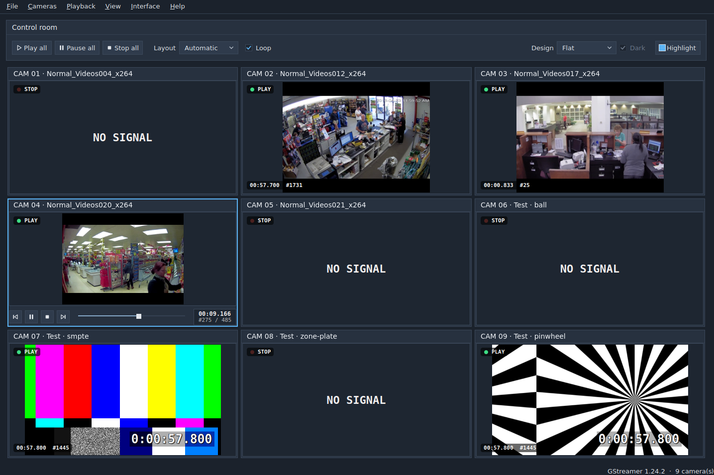

# Multicamera inspection: C++ / Qt 6 on GStreamer

A multicamera inspection system: an array of cameras, each one a GStreamer pipeline, on a board
drawn in the interface design of your choice. Click a camera to inspect it: its player controls
appear under its picture. Play or pause it, move along its time bar, and step through it picture by
picture with **E**.

The cameras are the recordings in [videos/](videos/) plus synthetic GStreamer test cameras
(`videotestsrc`), which burn their buffer time into the picture so every seek and step can be
checked by eye.



## Using it

- **Control room**: play, pause or stop every camera at once, choose the board layout (automatic or
  1–4 columns), loop recordings at their end, and pick the interface **Design** (and **Dark** mode for
  the designs that have one), and the **Highlight** colour of the mark round the camera under inspection
  (a colour picker; **Reset** goes back to the design's own).
- **Board**: each camera shows a status lamp (play / pause / stop), the time and number of the picture
  on screen. **Click** a camera to inspect it; **double click** maximises it: in single-camera mode the control room steps aside, and the camera keeps its own controls (without the selection mark).
- **Camera controls** (on the camera clicked, over the bottom of its card): previous frame, play / pause,
  stop, next frame, the time bar (drag or click to move) and a readout of the time and picture number /
  pictures in all (its tooltip adds the length and frame rate). The picture shrinks to make room for
  them, so they never cover it; they disappear when another camera, or none, is selected.

| Key | |
|---|---|
| **1** … **9** | inspect a camera (or click it) |
| **Esc** | inspect none, show every camera |
| **Space** | play / pause |
| **E** | next frame (hold to repeat); on a playing camera it first freezes the picture |
| **Q** | previous frame |
| **Home** | go to the start |
| **S** | stop |
| **F** | maximise the camera |
| **Ctrl+P** / **Ctrl+Shift+P** / **Ctrl+.** | play / pause / stop all |
| **Ctrl+1** … **Ctrl+5** | interface design |
| **Ctrl+D** | dark / light mode (Revolut, Metro) |

## Interface designs

Each design draws the widgets of the inspector, and the camera cards, through its own `QStyle`,
following its design rules. The choice, and the mode, are remembered.

- **Liquid Glass** (`glass`): frosted cards over an ambient canvas, clay buttons, a radiant glow round
  the camera under inspection.
- **Revolut** (`revolut`): Revolut.com in the Idetica identity, in a **light and a dark mode**: flat
  tinted cards under violet eyebrows, pill buttons (violet for the primary action), white app widgets,
  Inter type, and the amber focus ring round the camera under inspection (and round whatever has
  keyboard focus).
- **Metro** (`metro`): the Windows 8 Modern UI, in a **dark and a light mode**: each camera a flat live tile
  in its own accent colour (teal, magenta, purple, orange, green, red, blue), light Segoe section titles,
  square 2px stroke controls that fill with the accent when pressed, circular app-bar buttons on the
  camera's tile, and the selected tile marked by a white inner border and a check in its corner.
- **Flat** (`flat`): a slate operations console: lighter navy panels with a hairline and a
  sentence-case title on a slate canvas, a gutter of canvas round each camera, sunken fields, docked
  tabs over a steel-blue indicator, and one signal colour, azure, for the camera under inspection
  (a square 2px box) and the primary action; the status lamps keep green / amber / red.
- **Winamp** (`winamp`): brushed metal, cobalt LCD glass, LED status lamps, the selected module lit
  in LCD blue.

## GStreamer backbone

Every camera is a `CameraPipeline`:

```
recording:  playbin uri=file://…  (video only)  →  videoconvert ! video/x-raw,format=BGRx ! appsink
test:       videotestsrc pattern=… ! 640x360@25 ! timeoverlay ! videoconvert ! BGRx ! appsink
```

- Pictures are copied into a `QImage` on the streaming thread and announced to the GUI with a queued
  `frameReady()` (at most one pending: the GUI always takes the latest picture).
- **Play / pause / stop** map to PLAYING / PAUSED / READY; the bus is polled from the Qt event loop.
- **Seeking** is flushing and accurate, aimed at a picture of the frame grid.
- **Next frame** is a GStreamer step event (1 buffer) on the paused pipeline. **Previous frame** is an
  accurate seek to the picture before (GStreamer cannot step backwards).
- Picture times are put back on the frame grid (accurate seeks clip the timestamp of the picture
  overlapping the target), so the frame numbers stay exact.

## Build & run

The development environment is the Docker image of [.devcontainer/](.devcontainer/): Qt 6.4 and
GStreamer 1.24 with the MP4 demuxer (plugins-good) and the H.264 decoder (libav), the Inter font,
Catch2 for the tests and the tools CPack needs for the Debian package. Open the folder in the dev
container, or build the image yourself:

```bash
docker build -t qt6-gstreamer:v1.0 .devcontainer
docker run --rm -it -v "$PWD:/work" -w /work qt6-gstreamer:v1.0 bash
```

Then:

```bash
cmake -S . -B build
cmake --build build -j
ctest --test-dir build --output-on-failure
./build/inspector                       # the recordings in ./videos and 4 test cameras
./build/inspector --theme winamp --select 1
```

| `inspector` option | |
|---|---|
| `--theme <id>` | design: `glass`, `revolut`, `winamp`, `metro`, `flat` (default: the last one selected) |
| `--mode <light|dark>` | mode of the designs that have two (default: the last one selected) |
| `--videos <dir>` | folder of the recordings (default: `./videos`) |
| `--test-cameras <n>` | test cameras after the recordings (default 4) |
| `--columns <n>` | columns of the board (default: automatic) |
| `--select <n>` | camera to inspect at start (1 is the first) |
| `--paused` | do not start the cameras |
| `--maximize` | show the camera of `--select` alone (single-camera mode) |
| `--screenshot <dir>` | save `inspector-<theme>.png` and quit; `--theme all` saves every design (both modes of Revolut and Metro unless `--mode` is given); works with `-platform offscreen` |

## Packages

In the dev container, CPack builds the release packages into `build/packages/`:

```bash
SOURCE_DATE_EPOCH=$(git log -1 --format=%ct) cmake --build build --target package
sudo apt install ./build/packages/multicam-inspection_1.0.0_amd64.deb   # on Ubuntu 24.04
```

| Package | |
|---|---|
| `multicam-inspection_<version>_amd64.deb` | Debian / Ubuntu: `/usr/bin/inspector`, its menu entry and the documentation; depends on Qt 6 and on the GStreamer base, good, libav and x plugins |
| `multicam-inspection-<version>-Linux.tar.gz` | the same files, to unpack anywhere |

The recordings are not packaged: the installed inspector reads `videos/` in the folder it is started
from, or the folder given with `--videos`. `SOURCE_DATE_EPOCH` dates the packaged files to the
release commit instead of the moment of the build.

## Code

```
src/
  inspector/
    CameraSource        what a camera shows: a recording or a test pattern; discovery of videos/
    CameraPipeline      the GStreamer pipeline of one camera and its player controls
    CameraTile          one camera on the board, drawn by the design
    CameraControls      the player controls of the camera under inspection, on its card
    CameraGrid          the board: layout, selection, maximised camera
    InspectionWindow    control room, board, menus and shortcuts
    main.cpp            command line, screenshot mode
  WidgetStyle           base QStyle of the designs and their drawing vocabulary
  ThemeRegistry         the list of designs and their modes, applying one, the remembered choice
  Icons                 the transport glyphs, drawn as vectors
  themes/<id>/          one folder per design (Entry, Style, Theme tokens, drawing helpers)
packaging/              the menu entry of the Linux packages
tests/
  test_main               Catch2 inside a QApplication; test_support: waiting on the event loop, clicks, shortcuts
  test_camera_pipeline    states, accurate seeks, frame steps on test cameras and a recording
  test_inspection_window  the workflow: click a camera, its controls, E / Q, time bar, maximise, designs and modes
```
